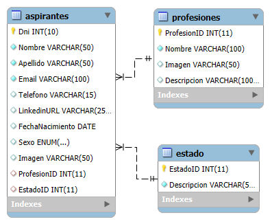
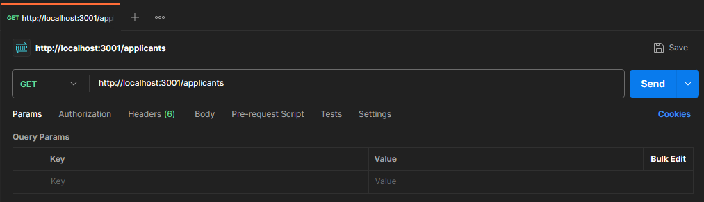
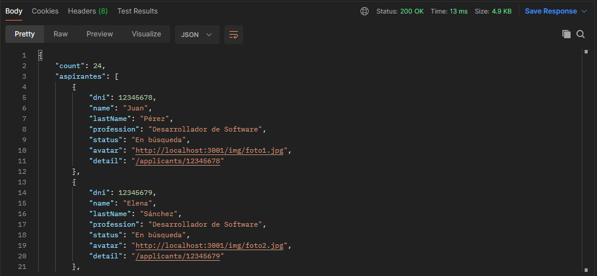
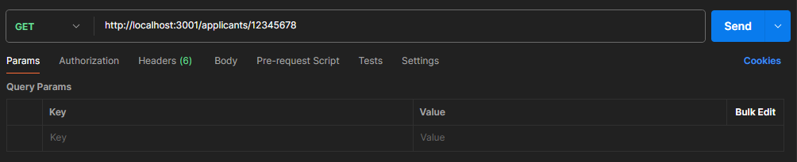
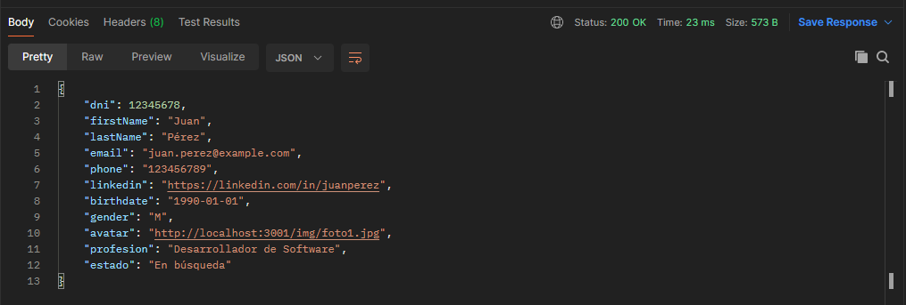
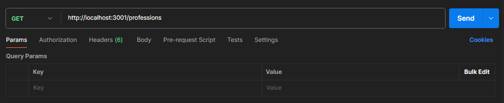
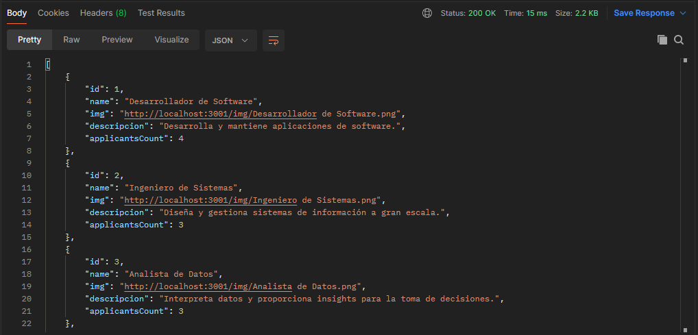

## Documentacion

Para la creacion de este proyecto utilizamos:  

- **_Express_** (para crear el proyecto).
- **_Nodemon_** (para actualizar automáticamente los cambios).
- **_CORS_** (para que las solicitudes no se crucen).
- **_Multer_** (para guardar las imágenes).
- **_MySQL2_** (base de datos del tipo MySQL).
- **_Sequelize_** (para la comunicación con la base de datos).

Para codear utilizamos **_Visual Studio Code_**, para la creacion de la base de datos **_MySQL Workbench_** y **_XAMPP_** para utilizar su servidor y su sistema de gestión de bases de datos. También utilizamos un navegador para probar nuestra aplicación.

### Modelo Entidad-Relacion

Contamos con tres tablas: **_aspirantes_**, **_profesión_** y **_estado_**. **_Aspirantes_** contiene todos los datos de cada aspirante, la tabla **_profesión_** tiene los datos de cada profesión y **_estado_** contiene las opciones en la que puede estar un aspirante 'Con trabajo', 'En búsqueda' y 'No disponible'.

### Endpoints de la API

#### <u>Listado de todos los aspirantes</u>

- **Método**: `GET`
- **Ruta**: `/applicants`  

**Descripción**: Se obtiene una lista de todos los aspirantes registrados en el sistema. En caso de que ocurra algún error, se arrojará un mensaje de error "Error al obtener los aspirantes".

#### <u>Detalles de un aspirante</u>

- **Método**: `GET`
- **Ruta**: `/applicants/:id`

**Descripción**: Se obtienen los datos de un aspirante específico. En caso de que ocurra algún error, se mostrará un mensaje correspondiente.

#### <u>Listado de todas las profesiones</u>
- **Método**: `GET`
- **Ruta**: `/professions`

**Descripción**: Se obtiene una lista de todas las profesiones registradas en el sistema.  En caso de que ocurra algún error, se mostrará un mensaje correspondiente.

