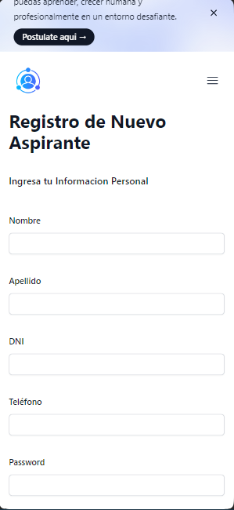

# React + Vite

This template provides a minimal setup to get React working in Vite with HMR and some ESLint rules.

Currently, two official plugins are available:

- [@vitejs/plugin-react](https://github.com/vitejs/vite-plugin-react/blob/main/packages/plugin-react/README.md) uses [Babel](https://babeljs.io/) for Fast Refresh
- [@vitejs/plugin-react-swc](https://github.com/vitejs/vite-plugin-react-swc) uses [SWC](https://swc.rs/) for Fast Refresh

## Manual de Usuario

### Inicio

En la primer seccion de la vista principal podremos observar una barra de navegacion con las opciones disponibles, las cuales son un logo que al hacer nos nos redirige al inicio, una opcion para seleccionar una profesion que al hacer clic en una de ellas nos redirige a una vista que nos lista los aspirantes con esa profesion. Tambien se cuenta con una opcion de empresas la cual no muestra contenido, sin embargo si se llega a hacer clic en la misma nos lleva a una vista de error.

Otra opcion es Aspirantes con la cual al hacer clic nos redirige a una vista donde podremos ver a todos los aspirantes registrados. La opcion de contacto nos redirige a un formulario para enviar un mensaje al soporte tecnico. Al hacer clic en postulate podremos acceder a un formulario de registro de aspirantes. Finalmente odemos observar la opcion de Acceder que nos lleva a un login.

Dentro de la vista principal, a continuacion de la barra de navegacion contamos con un baner con dos opciones que al hacer clic en cada una de ellas nos redirige al registro de aspirantes (Postulate) o a una lista de aspirantes (Leer mas)

### Lista de Aspirantes

La vista principal tambien cuenta con una pequeña lista de aspirantes, cada uno contenido en una tarjeta en la que podremos observar datos basicos como lo son su nombre completo junto con una foto de perfil, profesion y estado. Cabe destacar que al hacer clic en una de estas tarjetas podremos acceder a una vista con mas detalles del aspirante. Tambien se cuenta con dos opciones donde al interactuar con un clic nos redirige a un registro de asprantes (Postularse), o a mayor lista de aspirantes (Ver mas aspirantes)

### Profesiones

La tercer seccion de la vista principal es una lista de profesiones, donde podremos observar todas las profesiones disponibles con informacion como lo son nombre, descripcion y la cantidad de aspirantes con esa profesion. Al ser una lista extensa, la misma se encuentra disponible en paginas cuya numeracion la encontramos mas abajo como se puede observar en la imagen. Al hacer clic en cada uno de estos numeros nos muestra la pagina correspondiente a ese numero, donde se nos listaran las profesiones viculadas a esa pagina. 

### Pie de Pagina

En la ultima seccion de la vista principal encontramos informacion como ser una lista con los colaboradores, los cuales participaron en el desarrollo de la platafroma presentada. A su lado podemos observar otra lista con las principales opciones disponibles explicadas anteriormente. Finalmente se da a conocer informacion de contacto para el usuario que llegue a interacturar con la plataforma.

### Vista de Aspirantes

Dentro de esta vista, en la cual se listan todos los aspirantes registrados en la plataforma, encontramos al principio una opcion que nos permite seleccionar una profesion de las disponibles. Al seleccionar una de estas con un clic, la vista se recargara con una lista de aspirantes que cuentes con esa profesion. En caso de no selecionar una profesion tendremos a la vista todos los aspirantes registrados.

Como se venia mencionando la funcion principal de esta vista es listar a los aspirantes, por lo que podremos observar una lista de tarjetas cada una representando a un aspirante. Cabe mencionar que al hacer clic en una de estas tarjetas se nos redigira a una nueva vista, la que nos muestra todos los datos del aspirante con el que se interactuo.

Al ser una lista extensa como se describio en otro apartado, la misma tambien se encuentra dividida en paginas cuya numeracion entontramos mas abajo. Cada unos de los numeros representa una pagina y al hacer clic en uno de estos la vista se recarga con la pagina seleccionada.

### Registro de un Aspirante

La vista se compone de un formulario que nos permite ingresar todos los datos de una aspirante como ser nombre, apellido, dni, telefono, contraseña, email, linkedin, seleccion de profesion, seleccion de estado, seleccion de fecha de nacimiento, seleccion del sexo y la una seccion para subir una imagen de perfil.

Para acceder a cada uno de los campos mencionados basta con hacer clic en los mismo y podremos observar el texto que ingresemos con el teclado. En el caso de campos de seleccion al hacer clic, se nos listaran las opciones disponbles y podremos seleccionar una de ellas con un nuevo clic en la elegida.

Este formulario tambien cuenta con un campo para ingresar una imagen, donde al hacer clic en "subir un archivo" nos aparecera una nueva ventana para seleccionar una imagen en nuestro ordenador. 

Al final de este formulario contamos con dos opciones, una para limpiar los campos en el formulario (Borrar) y otra para proceder al registro con el boton Registro. Podemos interactuar con estas opciones simplemente haciendo clic en las mismas.

### Detalle de un Aspirante

### Vista de Contacto

### Vista de Error

## Diseño responsivo

