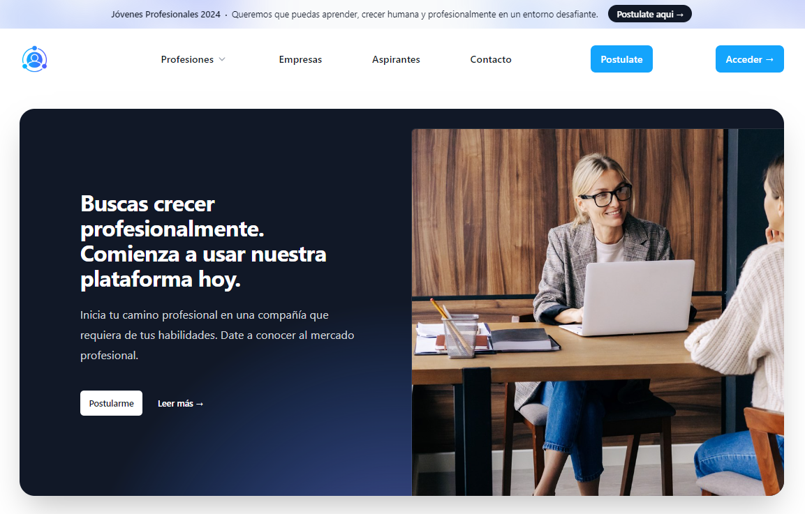

# DH-PP-Grupo7
Trabajo Integrador - Sprint Práctica Profesional

Para la creacion de este proyecto utilizamos:  

- **_React_** (FrontEnd).
- **_Tailwind_** (Estilos).
- **_Express_** (para crear el proyecto).
- **_Nodemon_** (para actualizar automáticamente los cambios).
- **_CORS_** (para que las solicitudes no se crucen).
- **_Multer_** (para guardar las imágenes).
- **_MySQL2_** (base de datos del tipo MySQL).
- **_Sequelize_** (para la comunicación con la base de datos).

Para codear utilizamos **_Visual Studio Code_**, para la creacion de la base de datos **_MySQL Workbench_** y **_XAMPP_** para utilizar su servidor y su sistema de gestión de bases de datos. También utilizamos un navegador para probar nuestra aplicación junto con **_Postman_**.

## Participantes Grupo 7 ✅

- Leonel Omar Ordoñez
- Brian Luciano Valeriano Jurado 
- Hector Fernando Calisaya
- Pablo Ignacio Garzón

## Vistas de la plataforma
El desafío de este sprint de práctica profesional está diseñado para demostrar nuestras habilidades en un entorno de proyecto real. Este ejercicio consiste en desarrollar una aplicación web full stack que permita visualizar un catálogo de aspirantes para una empresa multinacional de Recruiting de Recursos Humanos.

